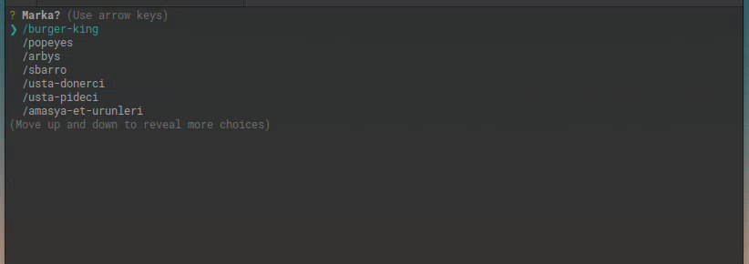

[](https://github.com/veysel/tiklagelsin)

# tiklagelsin

tiklagelsin cli

[](https://www.npmjs.com/package/tiklagelsin)
[](https://codecov.io/gh/veysel/tiklagelsin)

### Install tiklagelsin

```
npm install -g tiklagelsin
```

### Using tiklagelsin

open terminal and type tiklagelsin press enter

```
~$ tiklagelsin
```

[](https://github.com/veysel/tiklagelsin)


### Test and Coverage

```
npm test
```